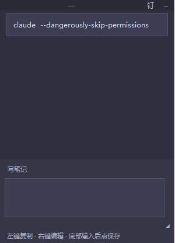

# FloatingNote（悬浮笔记）

Windows 桌面悬浮笔记工具：置顶显示、块状笔记、一键复制、托盘常驻、开机自启，可打包成免 Python 依赖的便携程序。

仓库地址：<https://github.com/mumu0215/FloatingNote>

## 界面预览



## 功能

- **无边框悬浮窗**：无系统标题栏，无最小化 / 最大化 / 关闭按钮
- **置顶半透明**：可切换钉选置顶
- **笔记块展示**：列表卡片显示，过长自动截断预览
- **左键复制**：点击笔记块，完整内容写入剪贴板
- **右键菜单**：编辑 / 复制 / 删除
- **底部输入 + 保存**：主窗口底部常驻输入框与「保存」按钮
- **可调大小**：拖边缘或右下角缩放，尺寸与位置自动记住
- **托盘常驻**：隐藏到托盘后台运行；托盘菜单退出
- **开机自启**：写入当前用户注册表 `Run` 项（可在托盘开关）
- **单实例**：通过 `floating_note.pid` 避免重复启动

## 环境要求

- Windows 10 / 11
- 源码运行：Python 3.10+
- 打包：需本机已装 Python 3.10+（`build_exe.bat` 会自动装 PyInstaller）

## 快速开始（源码）

```bat
dev.bat
```

后台启动 / 停止：

```bat
start.bat
stop.bat
```

依赖见 `requirements.txt`（`pystray`、`Pillow`）。首次运行脚本会自动创建 `.venv` 并安装。

## 便携包（免 Python）

```bat
build_exe.bat
```

生成目录：

```text
release/FloatingNote/
  FloatingNote.exe    # 双击运行（必须与 _internal 同目录）
  _internal/          # 嵌入式 Python / TclTk / 依赖（不可缺）
  assets/
```

将整个 `release/FloatingNote` 文件夹复制到任意位置即可使用，目标机无需安装 Python。

> **重要**：当前为 **onedir 文件夹分发**（exe + `_internal` 运行库），**不是**单一 exe。  
> 只拷贝 / 只运行 `FloatingNote.exe` 而缺少旁边的 `_internal` 时，会报  
> `Failed to start embedded Python interpreter`。  
> 笔记与配置保存在用户目录（见下），**重新执行 `build_exe.bat` 不会清空历史笔记**。

## 使用说明

| 操作 | 方式 |
|------|------|
| 写笔记并保存 | 底部输入框输入 → 点「保存」（或 `Ctrl+S` / `Ctrl+Enter`） |
| 复制笔记 | 左键点击笔记块 |
| 编辑 / 删除 | 右键笔记块 |
| 移动窗口 | 拖动顶部细条 `······` |
| 调整大小 | 拖窗口边缘，或右下角 `◢` |
| 置顶开关 | 顶部「钉」 |
| 隐藏到托盘 | 顶部「–」 |
| 再次显示 | 托盘图标 → 显示窗口 |
| 退出 | 托盘 → 退出 |
| 开机自启 | 托盘 → 开启 / 关闭开机自启 |

## 数据文件

笔记与配置写入**用户持久目录**（与安装/打包目录分离，重装、重新打包后仍保留）：

| 路径 | 说明 |
|------|------|
| `%LOCALAPPDATA%\FloatingNote\notes.json` | 笔记内容 |
| `%LOCALAPPDATA%\FloatingNote\config.json` | 窗口大小、位置、透明度、自启等 |
| `%LOCALAPPDATA%\FloatingNote\floating_note.pid` | 当前进程 PID（供 `stop.bat` 使用） |

- 可用环境变量 `FLOATING_NOTE_DATA` 自定义数据目录。
- 首次启动若持久目录尚无数据，会自动从旧版安装目录旁的 `data/` 迁移。
- 仓库内 `data/` 仅为开发默认模板，**不是**运行时主存储。

## 项目结构

```text
FloatingNote/
  app_entry.py          # 打包入口
  build_exe.bat         # PyInstaller 便携包构建
  assets/app.ico        # exe / 托盘图标
  dev.bat / start.bat / stop.bat
  dev.sh / start.sh / stop.sh
  requirements.txt
  src/
    main.py             # 主界面、托盘、交互
    storage.py          # JSON 读写
    autostart.py        # Windows 开机自启
    paths.py            # 源码 / 打包路径解析；用户数据目录
  data/                 # 仅开发模板（运行时不写这里）
```

## 开发说明

- UI：`tkinter`（无边框 `overrideredirect`）
- 托盘：`pystray` + `Pillow`
- 打包：`PyInstaller` onedir（见 `build_exe.bat`；Nuitka 在本环境 Python 3.13 上易崩溃，已改用 PyInstaller）
- 自启：`HKCU\Software\Microsoft\Windows\CurrentVersion\Run`，项名 `FloatingNote`

## License

MIT
